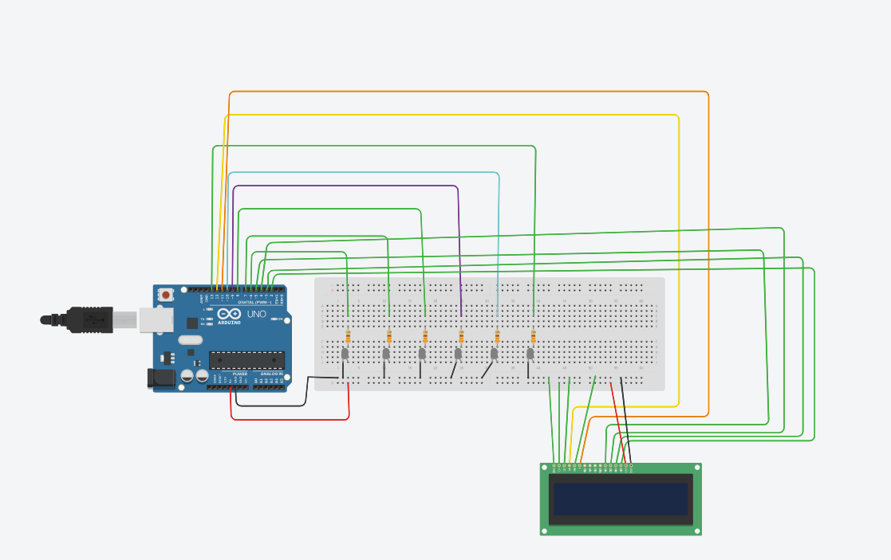
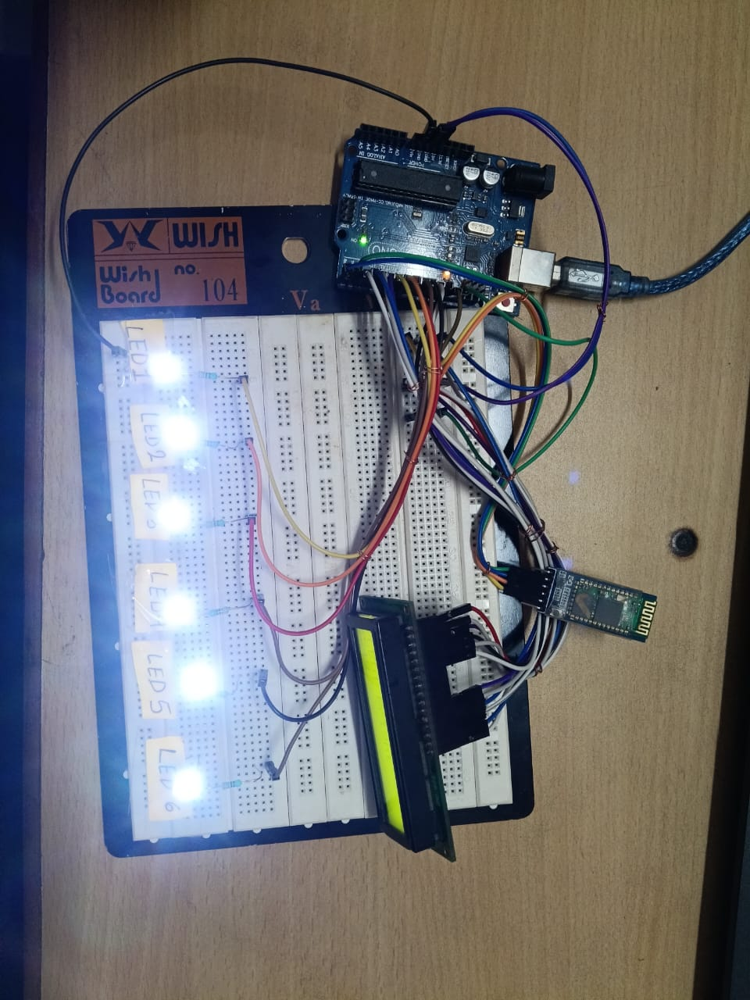
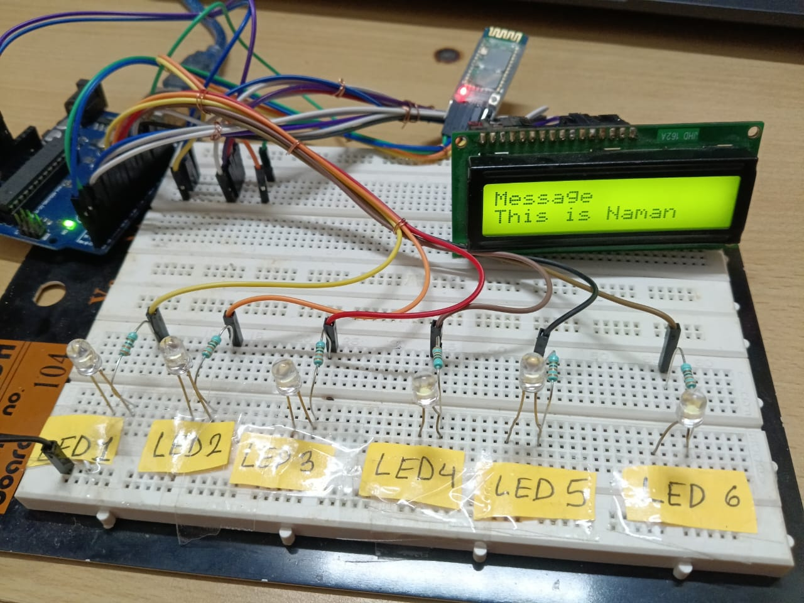
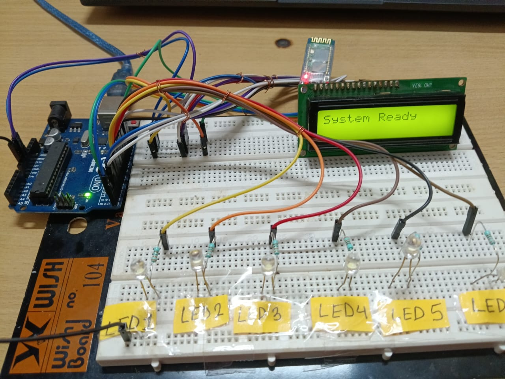

# Smart Bluetooth LED Control System

## Overview

This project is a Bluetooth-controlled LED automation system built using Arduino Uno.  
It allows wireless control of six LEDs through a mobile phone while displaying live status updates on an LCD screen.

The system demonstrates embedded programming, serial communication, hardware interfacing, and real-time control using Arduino.

---

## Features

- Wireless LED control using Bluetooth
- Controls 6 individual LEDs
- Simultaneous blinking mode
- Brightness control using PWM
- Emergency signal flashing mode
- Real-time LCD status display
- Custom text display on LCD
- Expandable for home automation projects

---

## Components Used

- Arduino Uno
- HC-05 Bluetooth Module
- 16x2 LCD Display
- Breadboard
- 6 LEDs
- Resistors
- Jumper Wires
- USB Power Supply

---

## Design & Development

### Arduino Control Unit
Arduino Uno acts as the main controller, receiving commands from the Bluetooth module and controlling outputs accordingly.

### Bluetooth Communication
The HC-05 module receives commands from a mobile phone and sends them to Arduino through serial communication.

### LED Output Section
Six LEDs are connected as independent outputs to demonstrate lighting control and signal patterns.

### LCD Interface
The LCD provides live feedback such as LED status, active mode, and custom text messages.

---

## Working Principle

1. User sends command from mobile phone  
2. Bluetooth module receives command  
3. Arduino processes input  
4. LEDs perform selected action  
5. LCD updates system status instantly

---

## Applications

- Smart home lighting prototype
- Wireless appliance control
- Embedded systems learning
- Arduino beginner project
- IoT foundation project

---

## Future Improvements

- Relay control for real appliances
- Mobile app interface
- Voice assistant control
- Wi-Fi control using ESP32
- Sensor-based automation

---

## Author

Naman Saini
## Circuit Diagram

## Pin Mapping

| Component | Arduino Pin |
|----------|-------------|
| LED1 | D6 |
| LED2 | D7 |
| LED3 | D8 |
| LED4 | D9 |
| LED5 | D10 |
| LED6 | D13 |
| LCD RS | D12 |
| LCD EN | D11 |
| LCD D4 | D5 |
| LCD D5 | D4 |
| LCD D6 | D3 |
| LCD D7 | D2 |
| LCD VSS (GND) | GND |
| LCD VDD (Power) | 5V |
| LCD VO (Contrast) | GND / Potentiometer |
| LCD RW | GND |
| LCD Backlight + | 5V |
| LCD Backlight - | GND |
| HC-05 TXD | Arduino RX (D0) |
| HC-05 RXD | Arduino TX (D1) |
| HC-05 VCC | 5V |
| HC-05 GND | GND |
> Note: HC-05 uses hardware serial pins D0/D1. Disconnect during code upload if needed.
## Project Images

